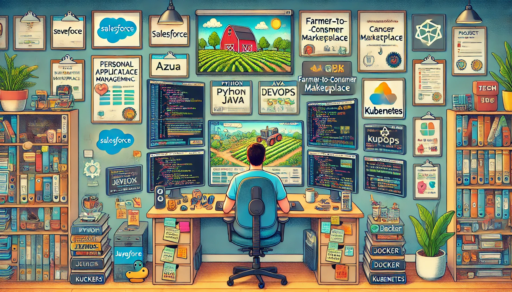

<h1 align="center"> Hi 👋, I’m Sivamani Asam</h1>
<h3 align="center"> DevOps | Full-Stack Developer | Seeking, Acquiring, Flourishing.</h3>
<!------>
<!------>

  

- 👀 I’m interested in ... Dev♾️Ops
- 🌱 I’m currently learning ... Full stack development

<!---<h3 align="left">Languages and Tools:</h3>

                    

--->

<!---<h3 align="left"> 📈 GitHub Stats</h3>  --->

  
  

  

<!---

--->

## 📫 How to reach me:

Feel free to reach out on any of the social platforms listed above, or email me at: `2100039060cse.r@gmail.com` or `asamsivamani18@gmail.com`.

<!--- 💞️ I’m looking to collaborate on ...
- 📫 How to reach me ...
- 😄 Pronouns: ...
- ⚡ Fun fact: ...--->
<!---
<!---
sivamani2943/sivamani2943 is a ✨ special ✨ repository because its `README.md` (this file) appears on your GitHub profile.
You can click the Preview link to take a look at your changes.
--->
